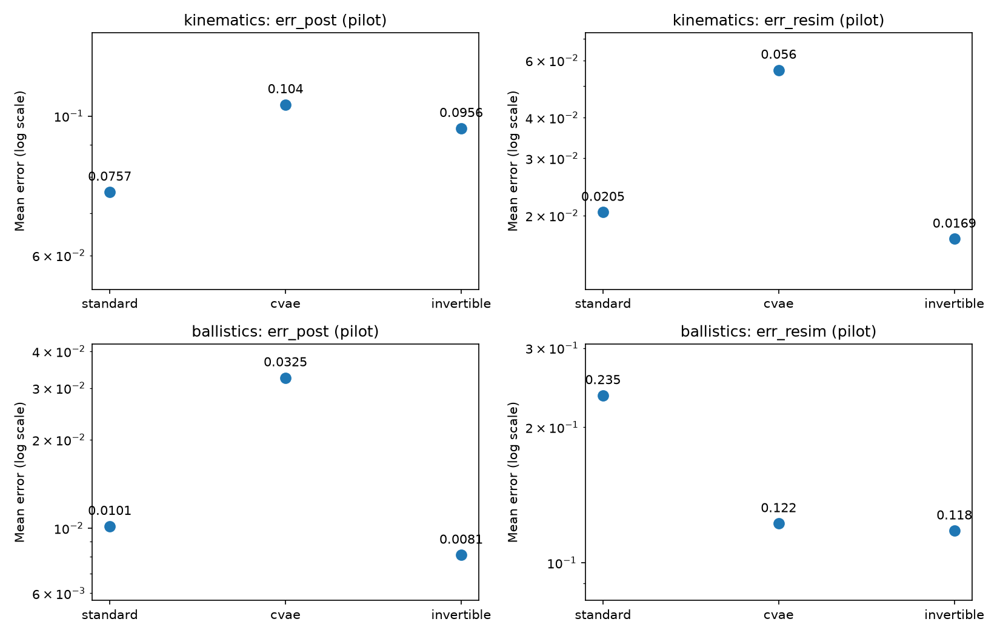
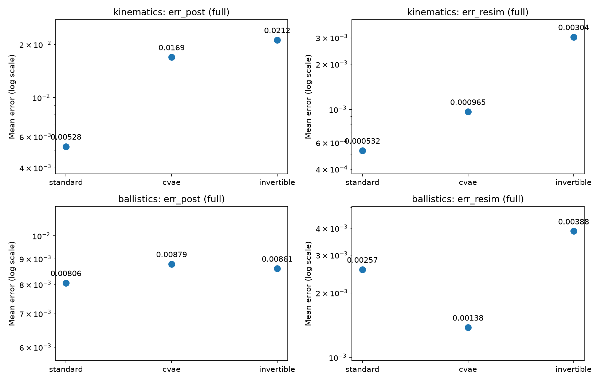

# Autoencoder baselines — implementation and results

We trained a standard autoencoder, a conditional VAE (cVAE), and a tied-transpose invertible autoencoder on the kinematics and ballistics inverse problems. Each model generates possible parameter vectors x for a given observation y. We ran a pilot experiment with small networks, then a full experiment with a larger parameter budget and more training data. All results below use seed 0 and an NVIDIA GeForce GTX 1650 Ti through CUDA.

## Files

| Path | Purpose |
|---|---|
| `models/autoencoder.py` | Standard encoder/decoder, MLP helpers, and sampling |
| `models/cvae.py` | Conditional VAE encoder, reconstruction, and KL loss |
| `models/invertible_autoencoder.py` | Decoder built from encoder weight transposes |
| `models/autoencoder_family.py` | Model construction and automatic width selection |
| `experiments/autoencoder_bench.py` | Training, checkpoint selection, evaluation, and diagnostics |
| `experiments/run_autoencoder_suite.py` | Runs all three families on both benchmarks |
| `experiments/summarize_autoencoder_suite.py` | Builds result tables and comparison plots |
| `metrics/evaluate.py` | Shared Err_post, Err_resim, and inference timing |
| `tests/test_autoencoder_family.py` | Checks gradients, sampling, parameter counts, and KL calculation |

## Models

### Standard autoencoder

The encoder maps x to an observation estimate y_hat and a latent vector z. The decoder reconstructs x from (y_hat,z). When generating samples, we supply the requested observation y_star and draw z from a standard normal distribution:

```text
training: x -> encoder -> (y_hat,z) -> decoder -> x_reconstructed
sampling: (y_star,z), z ~ N(0,I) -> decoder -> x
```

The encoder and decoder are separate MLPs, each with four hidden layers and ReLU activations. Hidden layers process the input; z is the latent output that carries information needed to distinguish solutions for the same observation.

| Benchmark | dim(x) | dim(y) | dim(z) |
|---|---:|---:|---:|
| Kinematics | 4 | 2 | 2 |
| Ballistics | 4 | 1 | 3 |

For both benchmarks, the combined (y,z) code has four dimensions. In the full experiment, each network has the structure `4 -> 705 -> 705 -> 705 -> 705 -> 4`.

### Conditional VAE

The cVAE encoder takes both x and y and predicts the mean and log-variance of q(z|x,y). During training, z is sampled from this distribution and the decoder reconstructs x from (y,z). During sampling, z is drawn from N(0,I).

The encoder and decoder each have four hidden layers with ReLU activations. Log-variance is clamped to [-12,12] for numerical stability. The decoder is deterministic given y and z, so variation between generated solutions comes from the latent draw.

### Invertible autoencoder

This model uses the encoder's weight transposes to decode, subtracts the corresponding biases, and reverses the modified LeakyReLU activations. The activation slope setting is 2. Encoder and decoder share their parameters, allowing a wider network within the same total budget.

Inversion is approximate: a weight transpose equals its inverse only under suitable orthogonality conditions. The baseline learns through reconstruction, with orthogonality regularization set to 0.

## Losses

Training losses use x and y standardized with training-set statistics.

| Family | Training loss | Baseline settings |
|---|---|---|
| Standard AE | `L_recon + a * L_y + b * L_z` | a = 1, b = 100 |
| cVAE | `L_recon + beta * KL(q(z|x,y) || N(0,I))` | beta = 0.01 |
| Invertible AE | `L_recon + a * L_y + b * L_z` | a = 1, b = 100; orthogonality weight = 0 |

For standard and invertible AE, `L_recon = ||x - D(y_hat,z)||^2` and `L_y = ||y_hat - y||^2`. The latent term is joint MMD squared between `[y_hat.detach(),z]` and `[y,epsilon]`, with epsilon drawn from N(0,I). It encourages z to follow the normal prior independently of y. Detaching y_hat directs this loss toward the latent output.

The cVAE reconstructs from the true y and its sampled latent vector. Its KL term keeps the learned latent distribution close to the normal sampling prior.

## Training settings

| Setting | Pilot | Full |
|---|---:|---:|
| Training pairs | 30,000 | 1,000,000 |
| Validation pairs | 2,000 | 20,000 |
| Epochs | 12 | 50 |
| Batch size | 256 | 1,000 |
| Maximum trainable parameters per model | 100,000 | 3,000,000 |
| Hidden layers per network | 4 | 4 |

Both profiles use Adam with learning rate 0.001, weight decay 0.00001, cosine learning-rate decay, and gradient clipping at norm 10. Training and validation data use seeds 10000 and 20000. The model seed is 0, and CPU work uses four threads.

We select the checkpoint using re-simulation error on 64 validation conditions with 32 generated samples each, using draw seed 991. An invalid sample receives a penalty of 100 for checkpoint selection. Test conditions are not used for selection. `model.pt` holds the selected checkpoint; `last_model.pt` holds the final epoch.

### Widths and parameter counts

The code chooses the largest hidden width that fits the profile's total parameter budget. Counts include all trainable weights and biases across the model.

| Benchmark | Family | Pilot width | Pilot parameters | Full width | Full parameters |
|---|---|---:|---:|---:|---:|
| Kinematics | Standard AE | 127 | 99,830 | 705 | 2,999,078 |
| Kinematics | cVAE | 126 | 98,540 | 704 | 2,992,008 |
| Kinematics | Invertible AE | 180 | 99,364 | 998 | 2,999,992 |
| Ballistics | Standard AE | 127 | 99,830 | 705 | 2,999,078 |
| Ballistics | cVAE | 126 | 98,668 | 704 | 2,992,714 |
| Ballistics | Invertible AE | 180 | 99,364 | 998 | 2,999,992 |

The full standard AE has 1,499,539 parameters in each of its two networks. Only the decoder runs when generating samples. Training data size and model size are separate choices: the full profile trains an approximately three-million-parameter model on one million (x,y) pairs.

## Evaluation

Every model is evaluated through the shared `metrics.evaluate` implementation. Err_post is unbiased MMD squared between model samples and rejection-sampling reference samples, in raw x units. Err_resim is the mean squared distance between f(x) and y_star. Lower values are better for both metrics.

| Setting | Pilot | Full |
|---|---:|---:|
| Test conditions | First 16 committed conditions | All 1,000 committed conditions |
| Model samples per condition | 256 | 1,000 |
| Target reference samples per condition | 256 | 1,000 |
| Total model samples timed | 4,096 | 1,000,000 |
| Reference proposal cap: kinematics | 20,000,000 | 2,000,000,000 |
| Reference proposal cap: ballistics | 20,000,000 | 50,000,000 |
| Minimum accepted reference samples: kinematics | 206 | 444 |
| Minimum accepted reference samples: ballistics | 256 | 111 |

The shared kernel is multi-scale IMQ with bandwidths 0.05, 0.2, and 0.9. Reference likelihood widths are sigma = 0.01 for kinematics and 0.02 for ballistics. The estimator supports unequal sample counts when the proposal cap leaves a condition with fewer reference samples. Biased MMD squared and means clamped at 10 are saved alongside the headline metrics; tables below show unbiased Err_post and plain mean Err_resim.

For ballistics, trajectories without a defined ground impact are excluded from Err_resim and reported in the failed-sample column. This fraction should be read alongside the error.

Timing starts after three warm-up calls and includes GPU synchronization and host conversion. Decoders process at most 8,192 samples at a time. Times below cover each profile's entire sampling workload. Pilot and full timings cannot be compared as if they measured the same amount of work; their error estimates also use different test sets and sample counts.

## Pilot results

Pilot training used at most 100,000 parameters, 30,000 training pairs, and 12 epochs. Evaluation covered 16 conditions with 256 samples per condition.

| Benchmark | Family | Err_post | Err_resim | Failed samples | Total sampling time (ms) |
|---|---|---:|---:|---:|---:|
| Kinematics | Standard AE | 0.07567 | 0.020469 | 0.0000% | 2.1 |
| Kinematics | cVAE | 0.10428 | 0.056017 | 0.0000% | 1.6 |
| Kinematics | Invertible AE | 0.09559 | 0.016942 | 0.0000% | 3.1 |
| Ballistics | Standard AE | 0.01015 | 0.235303 | 0.0244% | 2.5 |
| Ballistics | cVAE | 0.03253 | 0.122234 | 0.0000% | 1.3 |
| Ballistics | Invertible AE | 0.00810 | 0.117783 | 0.0488% | 3.4 |

Standard AE had the lowest kinematics Err_post, while invertible AE had the lowest Err_resim. On ballistics, invertible AE had the lowest value for both errors. These pilot rankings changed in the full experiment.



## Full results

Full training used at most 3,000,000 parameters, 1,000,000 training pairs, and 50 epochs. Evaluation covered all 1,000 conditions with 1,000 samples per condition.

| Benchmark | Family | Err_post | Err_resim | Failed samples | Total sampling time (ms) |
|---|---|---:|---:|---:|---:|
| Kinematics | Standard AE | 0.00528 | 0.000532 | 0.0000% | 2173.9 |
| Kinematics | cVAE | 0.01694 | 0.000965 | 0.0000% | 2171.8 |
| Kinematics | Invertible AE | 0.02121 | 0.003035 | 0.0000% | 4827.1 |
| Ballistics | Standard AE | 0.00806 | 0.002569 | 0.0149% | 2176.9 |
| Ballistics | cVAE | 0.00879 | 0.001379 | 0.0665% | 2197.9 |
| Ballistics | Invertible AE | 0.00861 | 0.003877 | 0.0694% | 4848.7 |



### Findings

On kinematics, standard AE gave the lowest error on both metrics. Its Err_post was about 3.2 times lower than cVAE and 4.0 times lower than invertible AE. Its Err_resim was about 1.8 and 5.7 times lower, respectively.

On ballistics, standard AE had the lowest Err_post, but cVAE had the lowest Err_resim: 0.001379 compared with 0.002569 for standard AE. cVAE also produced a higher fraction of invalid trajectories. The choice between them depends on which error and failure rate matter for the application.

Standard AE and cVAE both took about 2.2 seconds to generate one million samples. Invertible AE took about 4.8 seconds. Its wider shared network performs more decoder computation even though total trainable parameter counts are similar. The small timing difference between standard AE and cVAE needs repeated measurements before assigning a speed ranking.

The full runs have lower Err_resim than the pilot runs for every family. Model size, data size, training duration, and evaluation scope all changed together, so these runs do not isolate the contribution of any one change. Invertible AE's ballistics Err_post is slightly higher in full than in pilot, which also shows why the two evaluation scopes should not be treated as a controlled comparison.

## Ballistics sensitivity

The training prior gives launch speed v0 integer values, while the models output continuous values. We checked how this affects Err_post using the first eight test conditions in a separate diagnostic of the full models: 256 model samples per condition, a target of 128 reference samples, and a two-million-proposal cap. Standardized scores divide x by the prior standard deviations before calculating MMD.

| Family | Raw-unit Err_post | Standardized-x Err_post | Err_post after rounding v0 |
|---|---:|---:|---:|
| Standard AE | 0.00756 | 0.00112 | 0.00223 |
| cVAE | 0.00917 | 0.00322 | 0.00409 |
| Invertible AE | 0.00876 | 0.00234 | 0.00283 |

Rounding only v0 lowers this diagnostic score for every family; standardizing x also changes the score substantially. These checks show sensitivity to the representation and treatment of launch speed. They cover eight conditions and use altered evaluation settings, so they are reported separately from the full benchmark. The headline results use raw units, with no rounding or dequantization in training.

## Result files and reproduction

The tables come from [pilot records](first_trial_of_encoders_gpu.json) and [full records](second_trial_of_encoders_full_gpu.json). Each JSON contains configurations, selected epochs, training summaries, evaluation results, and diagnostics. Individual artifacts are stored under:

```text
experiments/runs/first_trial_of_encoders_gpu_<benchmark>_<family>_baseline_pilot_s0/
experiments/runs/second_trial_of_encoders_full_gpu_<benchmark>_<family>_baseline_full_s0/
```

Each run contains `config.json`, `log.csv`, `summary.json`, `model.pt`, `last_model.pt`, and evaluation/diagnostic outputs. Run directories are ignored by Git; the report JSON files keep the reported numbers available without model weights.

To run either profile with a new output prefix:

```bash
python experiments/run_autoencoder_suite.py --profile pilot --device cuda --prefix ae_pilot
python experiments/run_autoencoder_suite.py --profile full --device cuda --prefix ae_full
```

These findings come from one seed per configuration. Further comparisons should repeat the full runs across seeds and sweep the loss weights under the same parameter budget. Launch-speed handling should remain consistent across all ballistics comparisons.
