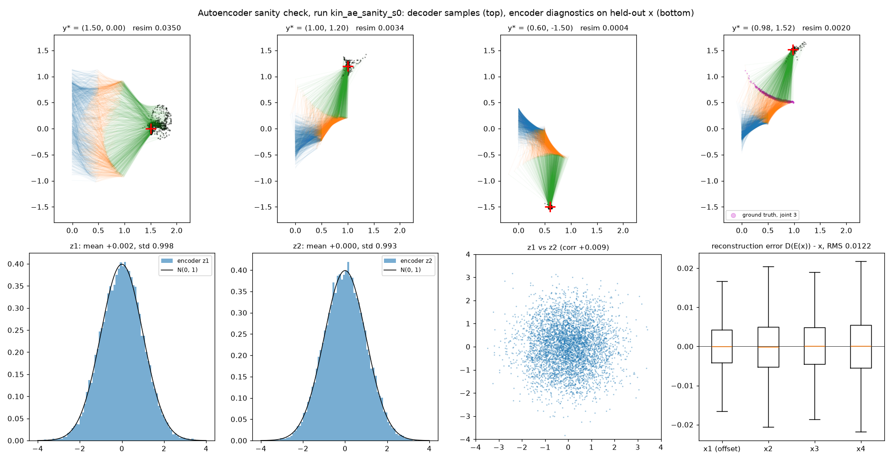

# Standard autoencoder — decisions, status, hand-off

Plain-autoencoder baseline of Kruse et al. (2021), arXiv:2101.10763, Sec. 2
(Eqs. 3, 7–8). Ordinary PyTorch, no FrEIA.

**Status: hand-off point.** Build-order steps 1–4 are done (data, networks,
losses, sanity plot). Step 5 (training on both benchmarks) and a first pass of
step 6 (evaluation) are also done with the placeholder schedule, see
[Results (50 epochs)](#results-50-epochs-placeholder-schedule). Left for Berker:
GPU timing, sweeps (step 7) and the final table, once the team fixes the shared
schedule. Every open choice is marked `TODO(berker)` in the code:

```bash
grep -rn "TODO(berker)" models/ experiments/
```

> ⚠️ **Read first: findings from the shared-metrics evaluation**
> (50-epoch numbers in [Results (50 epochs)](#results-50-epochs-placeholder-schedule);
> the findings were first seen on 10-epoch models, see
> [First evaluation](#first-evaluation-with-the-shared-metrics-10-epochs)):
>
> 1. **Accuracy is far better than the paper's autoencoder and close to our MDN.**
>    Kinematics Err_post 0.0053 (paper AE 0.037, our MDN 0.0031); Err_resim
>    0.0004 is even *lower* than our MDN's 0.0007. A tail of hard y\* remains
>    (mean ≈ 3.3× median).
> 2. **On CPU the autoencoder is NOT the fastest model: it is ~110× slower than
>    the MDN** (8.2 s vs 75 ms). This is expected from the architecture, not a bug.
>    **Inference time must be measured on a GPU**, with every model timed on the
>    same machine and in the same way, before any speed claim is made.
> 3. **Ballistics: almost level with our MDN on Err_post** (0.0081 vs 0.0071) and
>    ~6× better than the paper's AE (0.049). But raw-unit ballistics Err_post
>    mostly measures whether v0 is an integer (`docs/mdn.md`): 5× more training
>    barely moved it (0.0086 → 0.0081) while Err_resim kept falling.

## Files

| Path | Purpose |
|---|---|
| `models/autoencoder.py` | Encoder / decoder MLPs, `(ŷ, z)` split, the three losses, `sample(y_star, n)` |
| `metrics/mmd.py` → `mmd_torch` | Differentiable twin of the shared `mmd`; same kernel object, tested equal (`tests/test_metrics.py`) |
| `experiments/train_autoencoder.py` | Training; writes `experiments/runs/<run>/` (git-ignored), like `train_mdn.py` |
| `experiments/evaluate_autoencoder.py` | Scores a run with the shared `metrics.evaluate` (`--device cuda` for timing) |
| `experiments/plot_autoencoder_sanity.py` | Step 4: arm plot for fixed y\*, plus encoder-z and reconstruction diagnostics |
| `tests/test_autoencoder.py` | Shapes / split, parameter budget, gradient routing of L_z, `sample` = D(y\*, z) |
| `data/toy_data.py`, `experiments/plot_data.py` | Step 1, shared with the MDN (already on `main`) |

## Model

```
encoder E: x (4) -> (ŷ, z)      dim ŷ = dim y,  dim z = 4 - dim y
decoder D: (y, z) (4) -> x (4)
test time: z ~ N(0, I),  x = D(y*, z)        (decoder only)
```

| Benchmark | dim x | dim y | dim z |
|---|---|---|---|
| Kinematics | 4 | 2 | 2 |
| Ballistics | 4 | 1 | 3 |

The code is exactly as wide as x (no bottleneck), so at zero reconstruction
loss D is the exact inverse of E. In practice reconstruction never reaches
zero ("soft" invertibility); the sanity plot shows the residual per coordinate.

## Losses

`L = L_recon + a·L_y + b·L_z`, all in standardized units (training-set mean / std):

| Term | Formula | Notes |
|---|---|---|
| L_recon | `‖x − D(ŷ, z)‖²` | literal D(E(x)); decoding from the true y instead is a `TODO(berker)` |
| L_y | `‖ŷ − y‖²` | makes the y-slot carry the observation |
| L_z | `MMD([ŷ.detach(), z], [y, ε])`, ε ~ N(0, I) | Eq. 3 |

**L_z is on the joint `(y, z)`, not on z alone.** Eq. 3 needs z ~ N(0, I) *and*
z independent of y, otherwise sampling z from the prior at a fixed y\* is wrong.
A marginal MMD on z only checks the first. The joint version follows the INN
code of Ardizzone et al. (2019). ŷ is detached so the MMD only shapes z
(`test_joint_latent_mmd_does_not_train_y_hat`). `--latent-mmd marginal` is kept
for comparison.

**Kernel: shared with the metrics.** `mmd_torch` takes the same `imq_kernel`
(IMQ, h ∈ {0.05, 0.2, 0.9}) and the same unbiased estimator as Err_post, and a
test checks it equals `metrics.mmd.mmd` to 1e-10. One thing to know: here the
kernel acts on standardized (y, z), where typical distances are about 2–3, while
the bandwidths were chosen for raw x units. The largest bandwidth (0.9) is
still informative, and the probe below shows the term works. Whether wider
bandwidths train better is a `TODO(berker)`, but the metric itself must not
change.

## Choices (the paper does not specify these)

| Choice | Value | Status |
|---|---|---|
| Latent split | dim z = 4 − dim y (code size = dim x) | decided by the "no bottleneck" argument; larger z is a `TODO(berker)` |
| Networks | 2 MLPs, 4 hidden layers each, ReLU, width 705 | width solved for ≤ 3M total → **2,999,078** params; depth / activation `TODO(berker)` |
| Normalization | x and y standardized with training-set statistics | same as MDN |
| a (L_y weight) | 1 | placeholder, `TODO(berker)` |
| b (L_z weight) | 100 | from the coarse probe below, `TODO(berker)` |
| Optimizer | Adam, lr 1e-3, weight decay 1e-5, cosine schedule, grad-clip 10 | copied from MDN, `TODO(berker)` |
| Data / schedule | 1M train, 20k val, batch 1000, 50 epochs; seeds 10 000+s / 20 000+s | **same placeholders and seeds as the MDN**, pending the team's shared schedule |

## Probe of b (not a sweep)

Kinematics, 300k training samples, 5 epochs, a = 1. Val = held-out losses;
resim = mean ‖f(D(y, z)) − y‖² over 200 val y × 100 samples (provisional, not
the shared metric).

| b | val recon | val L_y | val L_z | resim |
|---|---|---|---|---|
| 0 | 0.0012 | 0.0020 | 0.0454 | 0.0927 |
| 10 | 0.0019 | 0.0047 | 0.0001 | 0.0223 |
| **100** | 0.0031 | 0.0071 | −0.0002 | **0.0091** |
| 1000 | 0.0266 | 0.0189 | −0.0002 | 0.0139 |

With b = 0 the model reconstructs best and samples worst: z drifts off the
prior, which is the failure mode the spec predicted. Too large a b costs
reconstruction and L_y. b is a trade-off, so it needs a real sweep with the
shared metrics on the full schedule.

## Sanity check (step 4)

Run `kin_ae_sanity_s0`: kinematics, 1M samples, **10 epochs only** (short on
purpose), defaults otherwise. 7 min on an M4 CPU.

```bash
.venv/bin/python experiments/train_autoencoder.py --problem kinematics --epochs 10 --run-name kin_ae_sanity_s0
.venv/bin/python experiments/plot_autoencoder_sanity.py kin_ae_sanity_s0
```



Final val: recon 0.0041, L_y 0.0016, L_z ≈ 0 (−0.0003, at the noise floor),
provisional resim 0.0033 (still dropping each epoch).

- **End points sit on y\*, and the arms spread over many poses** (top row).
  The posterior does not collapse to one pose.
- **Encoder z matches the prior on held-out x**: mean 0.002 / 0.000, std
  0.998 / 0.993, corr(z1, z2) = 0.009. Test-time sampling from N(0, I) is valid.
- **Reconstruction is not exact** (soft invertibility): RMS 0.012 in raw x
  units, with per-coordinate medians at 0, so there is no visible systematic bias.
- **Weak spot: low-density y\*.** At y\* = (1.5, 0), resim is 0.035 and the end
  points are visibly scattered. This is the same point where the MDN struggles
  (`docs/mdn.md`), and it is worse here.

Quick Err_post check (shared `metrics.mmd.mmd`, unbiased, cached ground truth),
first 100 of the 1000 test y\*, 1000 samples each. **Not the official number:**
that comes from `metrics.evaluate` on all 1000 after full training.

| | test y\* #0 | mean, 100 y\* | median, 100 y\* |
|---|---|---|---|
| Autoencoder, 10 epochs | 0.0020 | 0.0138 | 0.0048 |
| MDN K=16, 50 epochs (`kin_K16_s0`) | 0.0022 | 0.0027 | 0.0016 |

On a typical y\* the autoencoder is close to the MDN, but it has a heavy tail
(mean ≈ 3× median). The paper has the same ordering (AE 0.037 vs MDN 0.007).
The full 50-epoch schedule and the b sweep are the first things to try on the tail.

## Results (50 epochs, placeholder schedule)

Runs `kin_ae_s0` and `bal_ae_s0`: all defaults (1M train samples, 50 epochs,
batch 1000, a = 1, b = 100, joint latent MMD, seed 0). Same data seeds and
schedule as our MDN runs, so the two are directly comparable. Training took
35 / 37 min on an Apple M4 CPU. Scored with the shared `metrics.evaluate`
(1000 test y\* × 1000 samples, unbiased MMD²):

```bash
.venv/bin/python experiments/train_autoencoder.py --problem kinematics --run-name kin_ae_s0
.venv/bin/python experiments/evaluate_autoencoder.py kin_ae_s0 --name ae_s0
```

These are **not final**: the schedule is still the shared placeholder, a and b
are unswept, and inference time is from a CPU (Finding 2).

### Kinematics

| Model | Err_post (median [q1, q3]) | Err_resim (median [q1, q3]) | Inference, 1000 y\* × 1000 (CPU) |
|---|---|---|---|
| **Autoencoder, 50 epochs** | **0.0053** (0.0016 [0.0003, 0.0040]) | **0.0004** (0.0001 [0.0001, 0.0003]) | 7.9 s |
| Autoencoder, 10 epochs | 0.0141 (0.0054) | 0.0034 (0.0019) | 8.2 s |
| Our MDN K=16, 50 epochs | 0.0031 | 0.0007 (0.0003) | 75 ms |
| Paper autoencoder (Table 1) | 0.037 | 0.012 | < 1 ms (1080 Ti) |
| Paper MDN (Table 1) | 0.007 | 0.012 | 601 ms (1080 Ti) |

Biased-estimator Err_post: 0.0099. Max per-y\* Err_post 0.126, Err_resim 0.029.

- **~7× better than the paper's autoencoder on Err_post and ~30× on Err_resim.**
- **Close to our MDN**: Err_post 0.0053 vs 0.0031, and **Err_resim is lower
  than the MDN's** (0.0004 vs 0.0007). The paper's ordering (MDN ahead on
  Err_post) still holds, but the gap shrank from ~4.5× at 10 epochs to ~1.7×.
- **The low-density tail is smaller but not gone**: mean ≈ 3.3× median. At the
  hard point y\* = (1.5, 0), the provisional resim dropped from 0.035 to 0.005
  ([plot](../experiments/figures/autoencoder_sanity_kin_ae_s0.png)).
- Encoder z still matches the prior (mean ≤ 0.006, std 0.995 / 0.996,
  corr −0.007), and the reconstruction RMS halved (0.012 → 0.0065) with
  zero-median errors.
- Val losses were still slowly falling at epoch 50 (resim 0.0008 at epoch 30,
  0.0004 at epoch 40 and 50).

### Ballistics

| Model | Err_post (median [q1, q3]) | Err_resim (median [q1, q3]) | Inference, 1000 y\* × 1000 (CPU) |
|---|---|---|---|
| **Autoencoder, 50 epochs** | **0.0081** (0.0068 [0.0042, 0.0103]) | **0.0024** (0.0016 [0.0014, 0.0020]) | 8.0 s |
| Autoencoder, 10 epochs | 0.0086 (0.0071) | 0.0034 (0.0020) | 8.2 s |
| Our MDN K=16, 50 epochs | 0.0071 (0.0065) | 0.0012 (0.0011) | 74 ms |
| Paper autoencoder (Table 2) | 0.049 | confirm from Table 2 | < 1 ms (1080 Ti) |
| Paper MDN (Table 2) | 0.048 | 0.184 | 175 ms (1080 Ti) |

Biased-estimator Err_post: 0.0136. Re-simulation undefined for 0.01% of
samples. Max per-y\* Err_post 0.164, Err_resim 0.165 (no clamping needed).

- **~6× better than the paper's autoencoder on Err_post**, and only ~14% above
  our MDN.
- **Err_post barely moved with 5× more training (0.0086 → 0.0081), while
  Err_resim fell by 30%.** This fits the v0 caveat (Finding 3): most of the
  raw-unit ballistics Err_post is the integer-v0 penalty that every continuous
  model pays, so it hides real improvements. Decide the v0 handling before
  ranking models on ballistics.
- **Err_resim is 2× the MDN's, with outliers** (max 0.165 vs median 0.0016).
- **Not converged**: provisional val resim was still halving every 10 epochs
  (0.0087 → 0.0044 → 0.0020 at epochs 30 / 40 / 50). A longer schedule would
  likely help ballistics more than kinematics; worth raising when the team
  fixes the shared schedule.
- The early instability seen at 10 epochs did not hurt the final model.

## First evaluation with the shared metrics (10 epochs)

Official `metrics.evaluate`: all 1000 test y\* × 1000 samples, unbiased MMD²,
cached ground truth. Models: the 10-epoch runs `kin_ae_sanity_s0` and
`bal_ae_sanity_s0`, so these are **not final numbers** (the full schedule is
50 epochs). Output: `metrics/results/<benchmark>_ae_sanity10ep_s0.{json,npz}`.

```bash
.venv/bin/python experiments/evaluate_autoencoder.py kin_ae_sanity_s0 --name ae_sanity10ep_s0
.venv/bin/python experiments/evaluate_autoencoder.py bal_ae_sanity_s0 --name ae_sanity10ep_s0
```

### Kinematics

| Model | Err_post (median [q1, q3]) | Err_resim (median [q1, q3]) | Inference, 1000 y\* × 1000 samples |
|---|---|---|---|
| **Autoencoder, 10 epochs** | **0.0141** (0.0054 [0.0024, 0.0132]) | **0.0034** (0.0019 [0.0004, 0.0036]) | **8.2 s** (CPU) |
| Our MDN K=16, 50 epochs | 0.0031 | 0.0007 | 75 ms (CPU) |
| Paper autoencoder (Table 1) | 0.037 | 0.012 | < 1 ms (1080 Ti) |
| Paper MDN (Table 1) | 0.007 | 0.012 | 601 ms (1080 Ti) |

Biased-estimator Err_post: 0.0187. Hardware: Apple M4, CPU.

### ⚠️ Finding 1: accuracy beats the paper's AE, but there is a heavy tail

- The 10-epoch model is already **~2.6× better than the paper's autoencoder on
  Err_post and ~3.5× better on Err_resim**.
- It is **behind our MDN** (0.0141 vs 0.0031). The paper has the same ordering
  (AE 0.037 vs MDN 0.007).
- **Mean ≈ 2.6× median** (max 0.18): most of the error comes from a small
  number of hard y\* in low-density regions of p(y), e.g. y\* = (1.5, 0) in the
  sanity plot. **This tail is the first target** for the full 50-epoch schedule
  and the b sweep. Report median and quartiles next to the mean.

### Ballistics

| Model | Err_post (median [q1, q3]) | Err_resim (median [q1, q3]) | Inference, 1000 y\* × 1000 samples |
|---|---|---|---|
| **Autoencoder, 10 epochs** | **0.0086** (0.0071 [0.0045, 0.0104]) | **0.0034** (0.0020 [0.0017, 0.0027]) | **8.2 s** (CPU) |
| Our MDN K=16, 50 epochs | 0.0071 (0.0065 [0.0034, 0.0099]) | 0.0012 (0.0011 [0.0009, 0.0014]) | 74 ms (CPU) |
| Paper autoencoder (Table 2) | 0.049 | confirm from Table 2 | < 1 ms (1080 Ti) |
| Paper MDN (Table 2) | 0.048 | 0.184 | 175 ms (1080 Ti) |

Biased-estimator Err_post: 0.0141. Re-simulation undefined (no ground impact)
for 0.02% of samples (MDN: 0%). No clamping was needed (all values < 10).

### ⚠️ Finding 3: ballistics is almost level with the MDN, read with care

- **Err_post 0.0086 vs our MDN's 0.0071**: much closer than on kinematics, and
  **~5.7× better than the paper's autoencoder** (0.049).
- **The Err_post tail is mild** (mean ≈ 1.2× median), unlike kinematics.
  **Err_resim has a few large outliers**: max 0.27 against a median of 0.002.
  This is the outlier pattern the paper mentions for ballistics (Sec. 4.2), so
  report the median next to the mean.
- **Caveat: on ballistics, raw-unit Err_post mostly measures v0 integrality.** v0
  ~ Poisson(15) is always an integer in the ground truth, while the autoencoder
  (like every continuous model) outputs real values. For the MDN this was over
  80% of its Err_post (`docs/mdn.md`). So "close to the MDN" here partly means
  "both pay the same v0 penalty". The team's decision on standardization,
  rounding or dequantization must come before this comparison is final.
- **Training was unstable and still improving at epoch 10.** The provisional
  val resim jumped up in epochs 1–4 (0.048 → 0.065 → 0.041 → 0.069) and only
  settled after epoch 5 (0.0038 at epoch 9). The cosine schedule over 50 epochs
  should help; if the jumps persist, lower lr or grad-clip are the first knobs.

### ⚠️ Finding 2: on CPU the autoencoder is ~110× SLOWER than the MDN

The spec expected the autoencoder to be the fastest model in the study. On our
CPU measurement it is the opposite: **8.2 s vs 75 ms for the MDN**.

The same holds on ballistics: 8.2 s vs 74 ms.

**Why (architecture, not a bug):** the decoder pushes *every* sample through the
full 3M-parameter network: 1000 y\* × 1000 samples = 10⁶ forward passes, about
3·10¹² FLOPs. The MDN runs its big network **once per y\*** (1000 passes), and
drawing samples from the resulting Gaussian mixture is cheap. The more samples
per y\*, the bigger the gap.

The paper's "< 1 ms" was measured on a GTX 1080 Ti, and the paper does not say
exactly what was timed (per sample? per y\*? which batch size?). A batched MLP
forward pass is exactly what a GPU is good at, so the CPU number is not
representative.

**Decision: measure inference time on a GPU.** Rules for a fair comparison:
- time every model (AE, MDN, INN, cINN, …) **on the same GPU** with the same
  `metrics.evaluate.timed_sampling` call (1000 y\* × 1000 samples, after warm-up);
- report the GPU model and the batch layout next to the number;
- **do not compare our times with the paper's ms figures**, only with each other;
- keep the CPU numbers above as a secondary data point and say why they differ.

## Hand-off to Berker: what is left

1. **Full training** on both benchmarks with the team's agreed schedule
   (`--n-train/--epochs/--batch-size`). Already done once with the MDN
   placeholders (`kin_ae_s0`, `bal_ae_s0`, see Results); rerun when the
   schedule is fixed:
   ```bash
   .venv/bin/python experiments/train_autoencoder.py --problem kinematics --run-name kin_ae_s0
   .venv/bin/python experiments/train_autoencoder.py --problem ballistics --run-name bal_ae_s0
   ```
   About 4.5 s per 100 steps on an M4 CPU, so 50 epochs × 1000 steps ≈ 40 min.
2. **Evaluation** with the shared metrics. Do not reimplement them. The model
   already has the interface:
   ```python
   from metrics.evaluate import evaluate
   evaluate(model.sample, 'kinematics', name='ae_s0')   # model loaded as in plot_autoencoder_sanity.load()
   ```
   Report Err_post, Err_resim and the inference time. **Measure inference time
   on a GPU**: on CPU the autoencoder is ~110× slower than the MDN (see
   Finding 2 above). Time every model on the same GPU in the same way, then
   check whether the "fastest model / speed baseline" claim actually holds.
3. **Sweeps**, logging every run: b, a, `--latent-mmd joint|marginal`, depth /
   activation at a fixed 3M budget, larger dim z, decoding from true y in L_recon.
4. **Ballistics specifics** (see `docs/mdn.md`, "Caveats"): v0 is
   integer-valued (Poisson prior) and dominates raw-unit Err_post, and x₂ has
   a point mass at 0. Use whatever the team decides there, identically for all
   models.
5. **Final table** against the paper (Tables 1–2, autoencoder rows):

   | Benchmark | Err_post | Err_resim | Inference (paper, 1080 Ti) |
   |---|---|---|---|
   | Kinematics | 0.037 | 0.012 | < 1 ms |
   | Ballistics | 0.049 | confirm from Table 2 + boxplots (clamped outliers, Sec. 4.2) | < 1 ms |

   Our MDN beat the paper's MDN by a wide margin (`docs/mdn.md`), so compare
   the autoencoder against our MDN as well as against the paper's numbers.

## Known behaviour to watch

- **Residual reconstruction error → posterior bias.** Check whether the
  per-coordinate error in the sanity plot has a nonzero median. A systematic
  offset would show up as bias in the samples.
- **Bad numbers? Check z first.** Compare the encoder-z histograms and the
  `val_z` column of `log.csv` before touching anything else (see the b = 0 row
  above).
